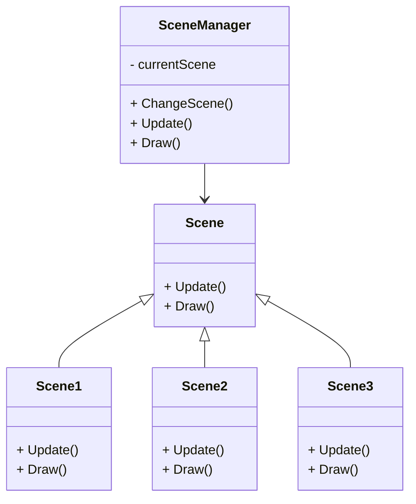

```mermaid
classDiagram
    class SceneManager {
        - currentScene
        + ChangeScene()
        + Update()
        + Draw()
    }
    class Scene {
        + Update()
        + Draw()
    }
    class Scene1 {
        + Update()
        + Draw()
    }
    class Scene2 {
        + Update()
        + Draw()
    }
    class Scene3 {
        + Update()
        + Draw()
    }
    SceneManager --> Scene
    Scene <|-- Scene1
    Scene <|-- Scene2
    Scene <|-- Scene3
```

