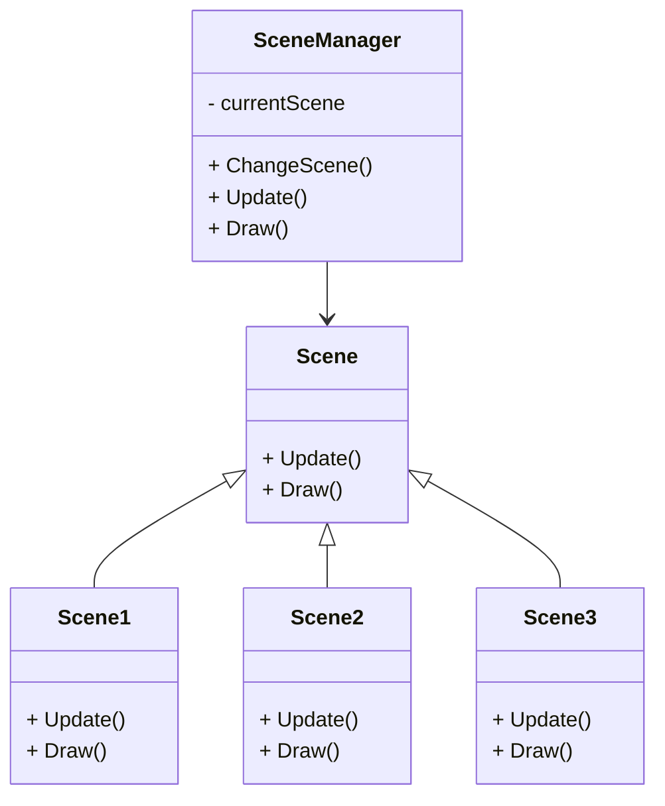
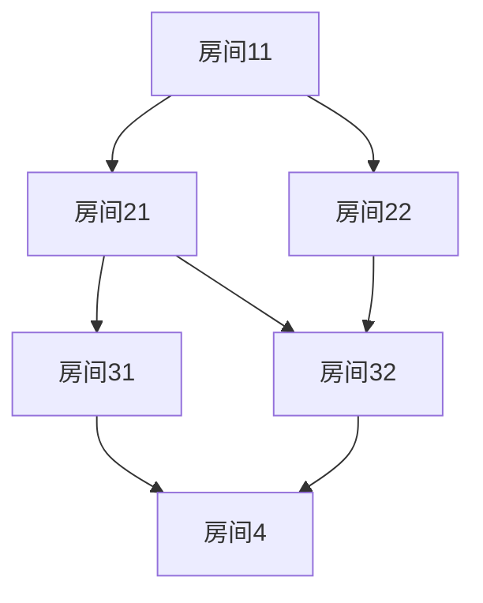

golang 
怎么生成 一个  只有一个起点，只有一个终点。  每条路径有固定长度的节点数的 一个图的函数

例如：

1-  2.1   -   3.1   -   4.1  -5
1-  2.2   -   3.2   -   4.2  -5
1-  2.2   -   3.3   -   4.2  -5
这三条路  就是一个完整的我想要的图。
这个函数入参是n,m  n是表示每条路径的长度，m表示一共有多少条路径