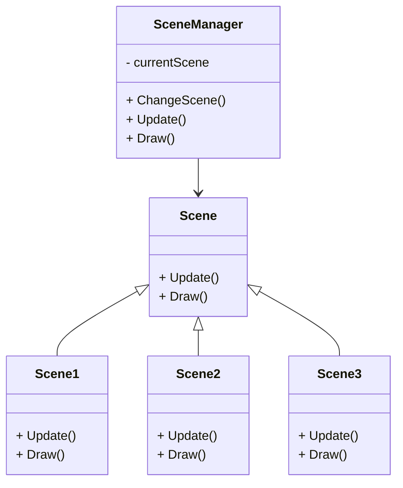
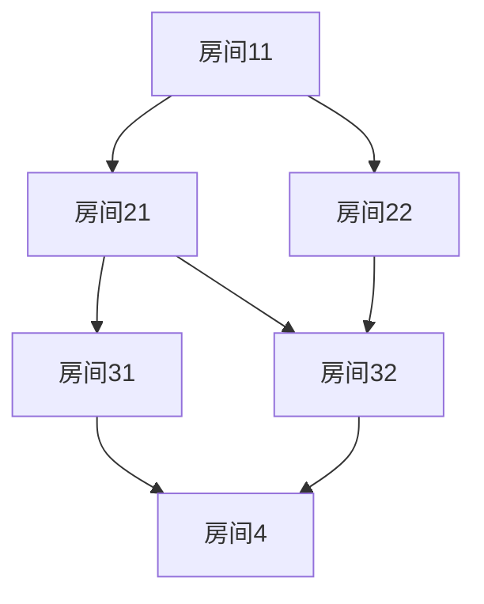

```mermaid
classDiagram
    class SceneManager {
        - currentScene
        + ChangeScene()
        + Update()
        + Draw()
    }
    class Scene {
        + Update()
        + Draw()
    }
    class Scene1 {
        + Update()
        + Draw()
    }
    class Scene2 {
        + Update()
        + Draw()
    }
    class Scene3 {
        + Update()
        + Draw()
    }
    SceneManager --> Scene
    Scene <|-- Scene1
    Scene <|-- Scene2
    Scene <|-- Scene3
```

```mermaid
graph TD
    R1[房间11] --> R2[房间21]
    R1 --> R3[房间22]
    R2 --> R4[房间31]
    R2 --> R5[房间32]
    R3 --> R5
    R4 --> R6[房间4]
    R5 --> R6

```

 / 1 - 3 - 4 - 5 - 6
0
 \ 2 - 4